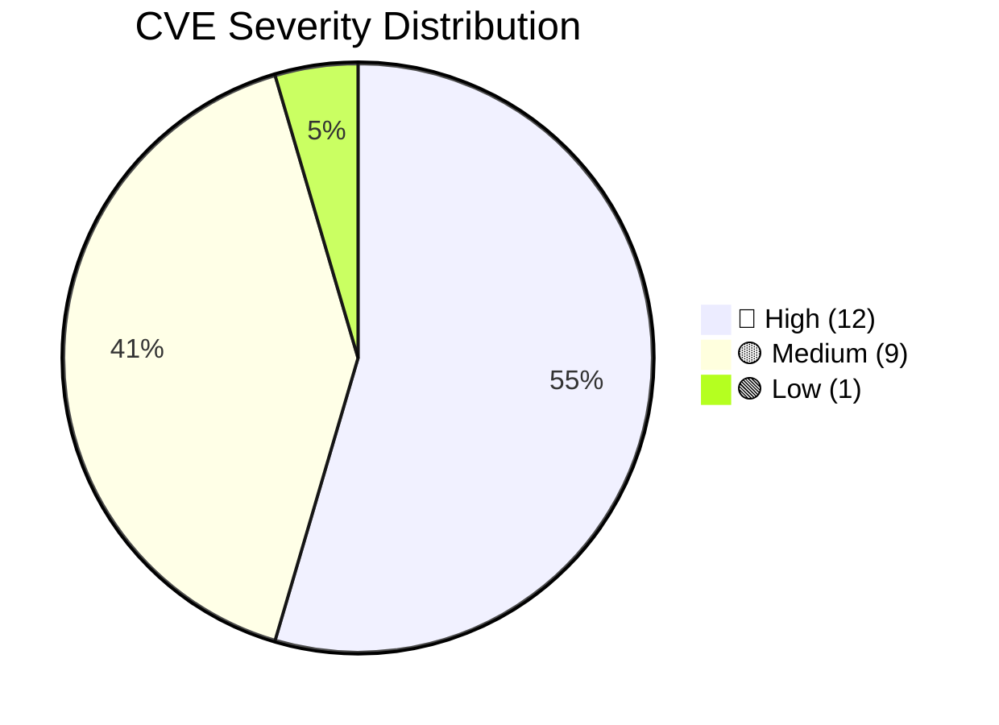
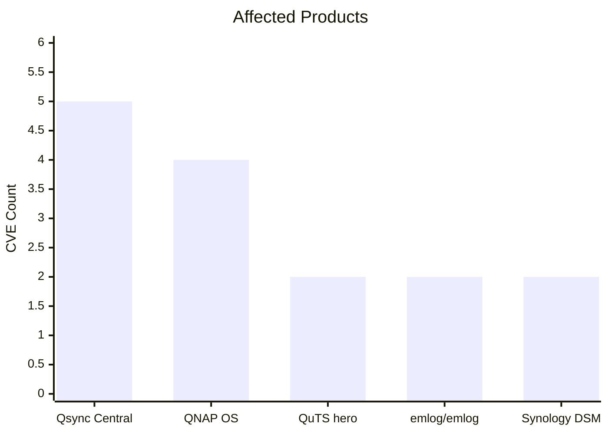

<div align="center">

<!-- Banner 区域 -->


<br />

#  **WEB HACKER TEAM**

```
$ whoami
>> Cybersecurity Research Collective | Est. 2024
>> We break things to make them stronger.
```

<div style="display: flex; justify-content: center; gap: 10px; margin: 15px 0; flex-wrap: wrap;">
  
  
  
  <a href="https://github.com/WebHackerTeam">
    
  </a>
</div>

</div>

---

> [!IMPORTANT]
> **我们正在寻找 0-day 猎手。** 如果你擅长 Web / Binary / IoT 漏洞挖掘，欢迎通过底部邮箱联系我们。

---

## 📡 MISSION BRIEFING

<details open>
<summary><b>🔓 点击折叠 | 了解我们的研究方向</b></summary>

<br />

| 领域 | 方向 | 威胁等级 |
|------|------|----------|
| **🌐 Web 应用** | SQL 注入 · XSS · SSRF · 反序列化 | `█████████░` CRITICAL |
| **💾 二进制 / IoT** | 缓冲区溢出 · 命令注入 · 权限提升 | `████████░░` HIGH |
| **☁️ 云 / 网络设备** | NAS 漏洞 · 防火墙绕过 · DoS | `███████░░░` ELEVATED |

> 我们专注于 **零日漏洞发现** 与 **安全研究**，累计向 QNAP、Synology 等厂商报送 22+ 个 CVE。

</details>

---

## 🧬 TECH DNA

<div align="center">

| 🧠 漏洞挖掘 | ⚔️ 渗透测试 | 🔬 逆向工程 | ☁️ 云安全 |
|:-----------:|:-----------:|:-----------:|:---------:|
| `IDA Pro` | `Burp Suite` | `Ghidra` | `Kubernetes` |
| `GDB / WinDbg` | `Metasploit` | `Frida` | `Docker` |
| `CodeQL` | `Nmap / Masscan` | `dnSpy` | `AWS / Azure` |

</div>

---

## 📂 CVE DATABASE

<details open>
<summary><b>📋 点击折叠 | 查看全部漏洞记录（共 22 个）</b></summary>

<br />

| CVE ID | 漏洞类型 | 影响产品 | 严重度 |
|--------|----------|----------|:------:|
| [](https://cve.org/CVERecord/SearchResults?query=CVE-2024-7962) | Arbitrary File Read | gaizhenbiao/chuanhuchatgpt | 🔴 |
| [](https://cve.org/CVERecord/SearchResults?query=CVE-2024-8029) | Cross-Site Scripting | imartinez/privategpt | 🟡 |
| [](https://cve.org/CVERecord/SearchResults?query=CVE-2024-12923) | Cross-Site Scripting | Photo Station | 🟢 |
| [](https://cve.org/CVERecord/SearchResults?query=CVE-2024-50405) | CRLF Injection | QuTS hero | 🟡 |
| [](https://cve.org/CVERecord/SearchResults?query=CVE-2024-50406) | Cross-Site Scripting | License Center | 🟡 |
| [](https://cve.org/CVERecord/SearchResults?query=CVE-2024-53693) | CRLF Injection | QuTS hero | 🟡 |
| [](https://cve.org/CVERecord/SearchResults?query=CVE-2024-56804) | SQL Injection | Video Station | 🔴 |
| [](https://cve.org/CVERecord/SearchResults?query=CVE-2024-56805) | Buffer Overflow | QNAP OS | 🔴 |
| [](https://cve.org/CVERecord/SearchResults?query=CVE-2025-22481) | Command Injection | QNAP OS | 🔴 |
| [](https://cve.org/CVERecord/SearchResults?query=CVE-2025-22482) | Format String | Qsync Central | 🟡 |
| [](https://cve.org/CVERecord/SearchResults?query=CVE-2025-29898) | Denial of Service | Qsync Central | 🟡 |
| [](https://cve.org/CVERecord/SearchResults?query=CVE-2025-30264) | Command Injection | QNAP OS | 🔴 |
| [](https://cve.org/CVERecord/SearchResults?query=CVE-2025-30265) | Buffer Overflow | QNAP OS | 🔴 |
| [](https://cve.org/CVERecord/SearchResults?query=CVE-2025-3535) | Denial of Service | BurpAPIFinder v2.0.2 | 🔴 |
| [](https://cve.org/CVERecord/SearchResults?query=CVE-2025-52867) | Denial of Service | Qsync Central | 🟡 |
| [](https://cve.org/CVERecord/SearchResults?query=CVE-2025-52868) | Buffer Overflow | Qsync Central | 🔴 |
| [](https://cve.org/CVERecord/SearchResults?query=CVE-2025-52869) | Buffer Overflow | Qsync Central | 🔴 |
| [](https://cve.org/CVERecord/SearchResults?query=CVE-2025-52870) | Buffer Overflow | Qsync Central | 🔴 |
| [](https://cve.org/CVERecord/SearchResults?query=CVE-2026-40532) | Forced Browsing | Synology DSM | 🟡 |
| [](https://cve.org/CVERecord/SearchResults?query=CVE-2026-40536) | Path Traversal | Synology DSM | 🟡 |
| [](https://cve.org/CVERecord/SearchResults?query=CVE-2026-46686) | Cross-Site Scripting | emlog/emlog | 🟡 |
| [](https://cve.org/CVERecord/SearchResults?query=CVE-2026-46687) | Local File Inclusion | emlog/emlog | 🔴 |

</details>

---

## 📊 THREAT ANALYTICS

<details open>
<summary><b>📈 点击折叠 | 查看漏洞统计图表</b></summary>

<br />

<div align="center">

**严重度分布**



**受影响产品 TOP 5**



</div>

</details>

---

## 📬 CONTACT

<div align="center">

| 📧 **E-mail** | 🐙 **GitHub** |
|:-------------:|:-------------:|
| `web_hacker@163.com` | [@WebHackerTeam](https://github.com/WebHackerTeam) |

</div>

---

<div align="center">

<br />

```
┌────────────────────────────────────────────────┐
│  ⚡ We hack for security, not for chaos. ⚡   │
│  Thanks for visiting our digital playground.  │
└────────────────────────────────────────────────┘
```

 <sub>root@webhacker:~# exit</sub>

</div>
