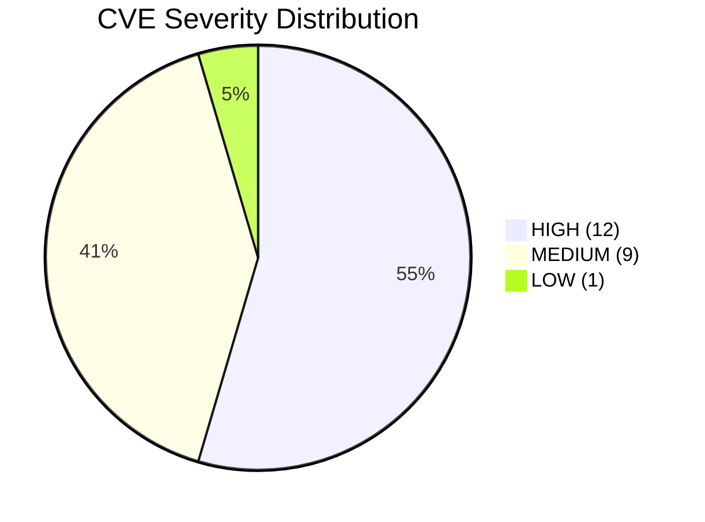

<div align="center">


<br />

```
 ██╗    ██╗███████╗██████╗       ██╗  ██╗ █████╗  ██████╗██╗  ██╗
 ██║    ██║██╔════╝██╔══██╗      ██║  ██║██╔══██╗██╔════╝██║ ██╔╝
 ██║ █╗ ██║█████╗  ██████╔╝█████╗███████║███████║██║     █████╔╝ 
 ██║███╗██║██╔══╝  ██╔══██╗╚════╝██╔══██║██╔══██║██║     ██╔═██╗ 
 ╚███╔███╔╝███████╗██████╔╝      ██║  ██║██║  ██║╚██████╗██║  ██╗
  ╚══╝╚══╝ ╚══════╝╚═════╝       ╚═╝  ╚═╝╚═╝  ╚═╝ ╚═════╝╚═╝  ╚═╝
```

**Cybersecurity Research Collective · Est. 2024**


</div>

<br />

```
╔══════════════════════════════════════════════════════════════╗
║                     MISSION BRIEFING                         ║
╚══════════════════════════════════════════════════════════════╝
```

> [!IMPORTANT]
> **We are hunting for 0-day hunters.** If you're skilled in Web / Binary / IoT vulnerability discovery, your seat is waiting. Reach us via email at the bottom.

<br />

<table>
<tr>
<td align="center" width="33%"><b>🌐 WEB</b></td>
<td align="center" width="33%"><b>💾 BINARY / IoT</b></td>
<td align="center" width="33%"><b>☁️ CLOUD / NETWORK</b></td>
</tr>
<tr>
<td align="center">SQLi · XSS · SSRF<br>Deserialization · RCE</td>
<td align="center">Buffer Overflow<br>Command Injection · PrivEsc</td>
<td align="center">NAS Vulns · Firewall Bypass<br>DoS · Auth Bypass</td>
</tr>
</table>

> 22+ CVEs reported to QNAP, Synology, emlog, and more. All fixed. ✅

<br />

```
╔══════════════════════════════════════════════════════════════╗
║                       TECH ARSENAL                          ║
╚══════════════════════════════════════════════════════════════╝
```

<div align="center">

| 漏洞挖掘 | 渗透测试 | 逆向工程 | 云安全 |
|:--------:|:--------:|:--------:|:------:|
| `IDA Pro` `GDB/WinDbg` `CodeQL` | `Burp Suite` `Metasploit` `Nmap` | `Ghidra` `Frida` `dnSpy` | `K8s` `Docker` `AWS/Azure` |

</div>

<br />

```
╔══════════════════════════════════════════════════════════════╗
║                    CVE DISCLOSURE LOGS                       ║
╚══════════════════════════════════════════════════════════════╝
```

<details open>
<summary><b>> cat /var/log/cve_disclosure.log | head -22</b></summary>

<br />

```
[2024-07] CVE-2024-7962  🔴 HIGH    | Arbitrary File Read        | gaizhenbiao/chuanhuchatgpt
[2024-08] CVE-2024-8029  🟡 MEDIUM  | Cross-Site Scripting       | imartinez/privategpt
[2024-09] CVE-2024-12923 🟢 LOW     | Cross-Site Scripting       | Photo Station
[2024-09] CVE-2024-50405 🟡 MEDIUM  | CRLF Injection             | QuTS hero
[2024-09] CVE-2024-50406 🟡 MEDIUM  | Cross-Site Scripting       | License Center
[2024-09] CVE-2024-53693 🟡 MEDIUM  | CRLF Injection             | QuTS hero
[2024-10] CVE-2024-56804 🔴 HIGH    | SQL Injection              | Video Station
[2024-10] CVE-2024-56805 🔴 HIGH    | Buffer Overflow            | QNAP OS
[2025-01] CVE-2025-22481 🔴 HIGH    | Command Injection          | QNAP OS
[2025-01] CVE-2025-22482 🟡 MEDIUM  | Format String              | Qsync Central
[2025-02] CVE-2025-29898 🟡 MEDIUM  | Denial of Service          | Qsync Central
[2025-03] CVE-2025-30264 🔴 HIGH    | Command Injection          | QNAP OS
[2025-03] CVE-2025-30265 🔴 HIGH    | Buffer Overflow            | QNAP OS
[2025-04] CVE-2025-3535  🔴 HIGH    | Denial of Service          | BurpAPIFinder v2.0.2
[2025-05] CVE-2025-52867 🟡 MEDIUM  | Denial of Service          | Qsync Central
[2025-05] CVE-2025-52868 🔴 HIGH    | Buffer Overflow            | Qsync Central
[2025-05] CVE-2025-52869 🔴 HIGH    | Buffer Overflow            | Qsync Central
[2025-05] CVE-2025-52870 🔴 HIGH    | Buffer Overflow            | Qsync Central
[2026-03] CVE-2026-40532 🟡 MEDIUM  | Forced Browsing            | Synology DSM
[2026-03] CVE-2026-40536 🟡 MEDIUM  | Path Traversal             | Synology DSM
[2026-04] CVE-2026-46686 🟡 MEDIUM  | Cross-Site Scripting       | emlog/emlog
[2026-04] CVE-2026-46687 🔴 HIGH    | Local File Inclusion       | emlog/emlog
```

</details>

<br />

```
╔══════════════════════════════════════════════════════════════╗
║                    THREAT ANALYTICS                          ║
╚══════════════════════════════════════════════════════════════╝
```

<details open>
<summary><b>> python analyze.py --cve-stats</b></summary>

<br />

<div align="center">



| 严重度 | 数量 | 占比 | 进度条 |
|:------:|:----:|:----:|:------:|
| 🔴 HIGH | 12 | 54.5% | `████████████████████████████` |
| 🟡 MEDIUM | 9 | 40.9% | `██████████████████████` |
| 🟢 LOW | 1 | 4.6% | `██` |

</div>

</details>

<br />

```
╔══════════════════════════════════════════════════════════════╗
║                     ESTABLISH CONNECTION                     ║
╚══════════════════════════════════════════════════════════════╝
```

<div align="center">

| 📧 Email | 🐙 GitHub |
|:--------:|:---------:|
| **web_hacker@163.com** | [@WebHackerTeam](https://github.com/WebHackerTeam) |

</div>

<br />

<div align="center">

```
┌─────────────────────────────────────────────────────────────┐
│  ⚡ We hack for security, not for chaos.                   │
│  Thanks for visiting our digital playground.              │
└─────────────────────────────────────────────────────────────┘

$ exit

Connection to github.com closed.
```

</div>
